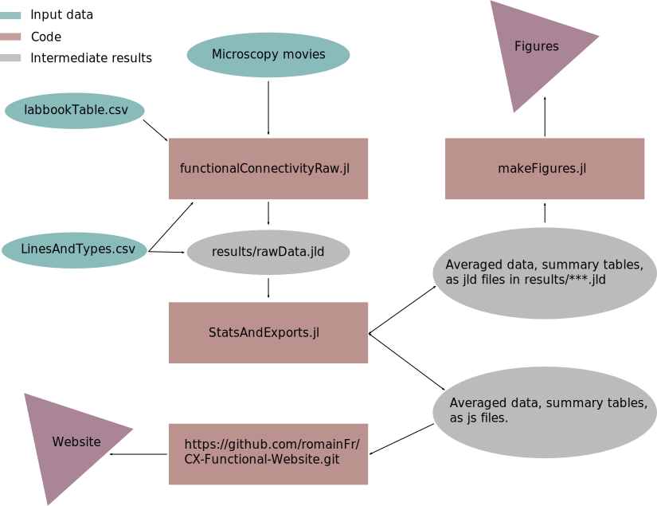

# CX-Functional-Analysis
Code and instructions to reproduce all the analysis used to generate the figures in () and the tables underlying the associated [website](https://romainfr.github.io/CX-Functional-Website/).

## Installation, prerequesites
- Download and install [Julia](https://julialang.org/downloads/)
- Install the associated packages. At the Julia prompt, type :
```julia
  Pkg.clone("https://github.com/romainFr/FluorescentSeries.jl.git")
  Pkg.clone("https://github.com/romainFr/subpixelRegistration.jl.git")
  Pkg.clone("https://github.com/romainFr/PrairieIO.jl.git")
  Pkg.clone("https://github.com/romainFr/PrairieFunctionalConnectivity.jl.git")
  Pkg.add("JLD","Unitful","Interpolations","StatsBase","Distributions","JSON","DataStructures","Bootstrap","Distance")
```
- Download or clone this repository.
- Download either some of the raw data (link) or more realistically the intermediate results tables by the downloading the ```results``` folder on [this OpenScienceFramework page](https://osf.io/vsa3z/)
and put it in a ```data``` folder inside this repository folder

## Content, analysis pipeline

The table ```LinesAndTypes.csv``` is identical to ```Table 1``` of the paper and contains about cell types and innervation patterns of the driver lines used in the study.
The table ```labbookTable.csv``` is, well, a labbook (all the metadata necessary to run the analysis). Each row corresponds to one fly.

The ```code``` folder contains three scripts (and soon notebooks for the corresponding scripts), all meant to be run from the ```CX-Functional-Analysis``` folder :
- ```functionalConnectivityRaw.jl``` 
- ```StatsAndExports.jl```
- ```makeFigures.jl```

To summarize, the workflow is schematized as : 
 

## 
